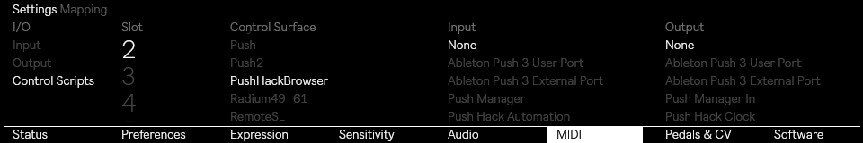
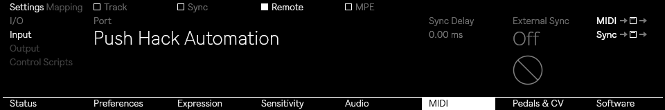
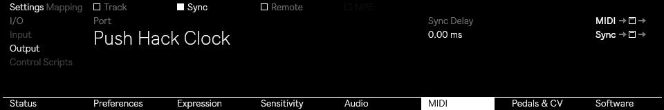

# Push Hack Manual

This is a simple getting started guide that explains how to install, uninstall, configure and use **Push Hack**.

Please remember that this hack is **unofficial**, and this project is <ins>**NOT**</ins> approved, endorsed or supported by Ableton. 

**Use this hack at your own risk**.

I don't provide support for this but if you need help, join the [Discord Server](https://discord.gg/8y6aYxy9nU).

## Before we start
1. The Push Hack works *only* with Push 3 Standalone.
2. Make sure that Push is updated to the latest version available. This hack has been tested on:
    * Beta release: **2.4.5b8** (aka Live 12.4.5b8)
    * Stable release: **2.4.3** (aka Live 12.4.3)
3. When a new version of the Push software is available, **you need to uninstall the hack and reinstall it before upgrading**.

These instructions are written for users of the macOS operating system. Windows users, see the [Windows section](#windows-users) below before starting.

## Installing
Your computer and Push 3 Standalone must be connected to the same Wi‑Fi network. Make sure the connection is **stable** and that it doesn't drop during installation. If you're concerned about network reliability, you can enable the hotspot directly on Push from the settings and connect to it instead.

At the end of the installation, Push will automatically reboot. Make sure to save any important files before proceeding.

* Go to http://push.local/pair to pair your computer with Push.
* Download the Push Hack and unzip it
* Open your Terminal (`Applications > Utilities > Terminal`)
* Go to the downloaded folder:
    
    You can type `cd ~/Downloads/push-hack` or simply `cd `(with a space at the end) and then drag and drop the unzipped folder into the Terminal and then press `ENTER`
* Now type: `./scripts/install.sh` and press `ENTER` and then follow the on-screen instructions.

If you never connected to your Push via SSH the installation script will automatically create an SSH key for you. Follow the instruction provided by the script. Make sure that you add your SSH key to http://push.local/ssh and then press `Shift`+`Select`+`Preferences` (gear icon) on your Push.

## Windows users

The install/uninstall scripts are bash scripts — they don't run in PowerShell or `cmd.exe`. Use **[Git for Windows](https://git-scm.com/download/win)**, which includes **Git Bash**.

1. Install Git for Windows (default options are fine).
2. Download the Push Hack and unzip it.
3. Open **Git Bash** (not PowerShell, not Command Prompt).
4. Go to the downloaded folder, e.g.: `cd "/c/Users/<you>/Downloads/push-hack"`
5. Run `./scripts/install.sh` and follow the on-screen instructions.

No other tools needed — the scripts don't depend on `jq`, `python`, or anything else outside Git Bash's built-in coreutils.

**Note on `python`/`python3` on Windows:** Windows ships fake `python`/`python3` stubs that just open the Microsoft Store instead of running Python, even if you don't have Python installed. If `command -v python3` seems to "find" something but it fails when run, that's why — installing `jq` sidesteps the issue entirely.

## Uninstalling

To uninstall the Push Hack, connect your computer and your Push 3 to the same WiFi network as instructed above.

Browse to the downloaded Push Hack folder and run the uninstall script:

`./scripts/uninstall.sh`

If you want to remove ALL the data, add the --purge flag

`./scripts/unistall.sh --purge`

## Updating Push's Software with the hack installed

Whenever a software update for Push is released, we **highly recommend** uninstalling the hack by following the instructions above before proceeding with the update, then reinstalling it afterwards.

If you forget to do this and start the update, Push will (hopefully) still update. However, once the update finishes, it will get stuck while rebooting, and the screen will remain black.

If this happens: hold down the power button on Push for a few seconds until it turns off completely. Wait a few seconds, then turn it back on. Finally, verify that the update was installed successfully.

## Additional Set up
Some hacks required additional set up to work properly. Please follow these instructions.

### Browser Bridge Hack
To use the **Browser** feature in Push Manager or Push Hack's Shadow UI to be able to load presets from Live's library, you need to enable the **PushHackBrowser** Remote Script.

You'll need Live 12.4 or later installed on Push.

1. Make sure the **browser-bridge** hack is installed (it's installed by default).
2. Open **MIDI Preferences*** on Push
3. Use the top-left knob to select  `Control Scripts`
4. Select an empty slot
5. Use the third knob to scroll through the **Control Surface** list, then select `PushHackBrowser`.
6. Leave *Input* and *Output* set to **None**
7. Reboot Push for the setting to take effect.

###  Automation Hack
To use the **Automation** feature in Push Manager, you need to connect to http://push.local:7703

You'll need Live 12.4 or later installed on Push.

1. Make sure that **automation** hack is installed (it's installed by default).
2. Open **MIDI Preferences** on Push
3. In the **Input** tab, scroll to select **Push Hack Automation** and enable the **Remote** checkbox. Leave Track, Sync and MPE disabled.
4. In the **Output** tab, scroll to select **Push Hack Clock** and enable the **Sync** checkbox. Leave Track and Remote disabled.

When writing automation in the browser you'll then need to map them to Push as you'd do with any external MIDI controller.

1. Open **MIDI Preferences** on Push
2. Select **Mapping**
3. Select **Add Mapping** and follow the steps on the screen. If the automation is active you should receive the MIDI CC automatically.
