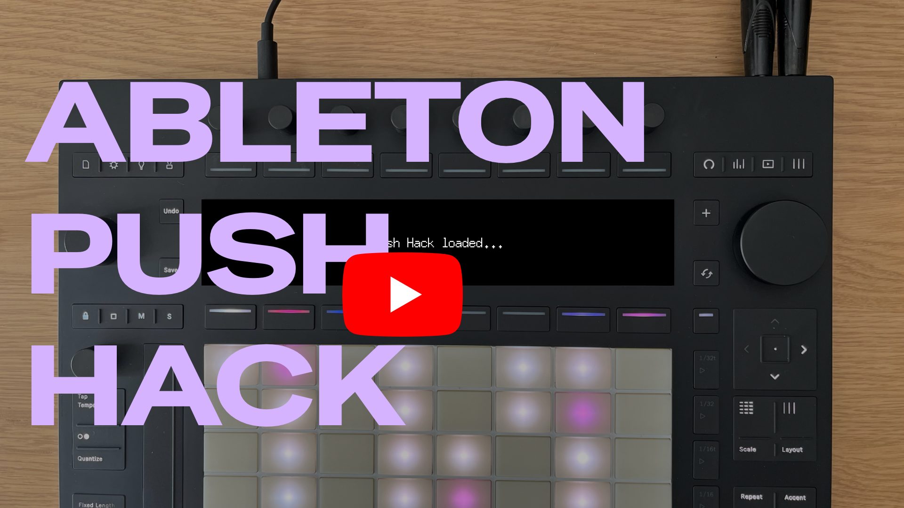

# Push Hack


An unofficial extensible hack framework for **Ableton Push 3 Standalone**. Deploys additional services to Push via SSH without touching the system partition or the built-in software.

This project was inspired by the work done in the [Move Anything](https://github.com/bobbydigitales/move-anything) and [Schwung](https://github.com/charlesvestal/schwung) projects.

* 📕 [Read the Manual](MANUAL.md)
* 🛟 [Would you like to contribute to the project?](CONTRIBUTING.md)
* 💬 [Join the Discord Community](https://discord.gg/8y6aYxy9nU) to discuss this project.
* 🎥 [Watch the demo video on YouTube](https://www.youtube.com/watch?v=fsYWSZ-MSDk)

---

## ⚠️ Important Notice ⚠️

> [!WARNING]
> This project is <ins>**NOT**</ins> approved, endorsed or supported by Ableton. **Use at your own risk**.
>
> Push Hack installs additional software on your Ableton Push 3 Standalone. Back up important sets, files and samples before installing the hack and familiarize yourself with the [official recovery methods for Push 3 Standalone](https://help.ableton.com/hc/en-us/articles/10726712498076-Recovery-methods-for-Push-3-standalone) in case you need to restore your device.

This **Push Hack** is a more of a prototype than a finished product. It's been built using AI-assisted coding tools (see the AI Disclosure below) as a fun technical experiment. While it works, it's not intended for everyday or production use, especially in professional contexts and environments. Keep this in mind if and when you're using it.

> [!CAUTION]
> Push Hack must be uninstalled an reinstalled after any Push's software update. Because of that, make sure that your Push is on the latest version available before installing the hack. **When a Push Software update is available**: uninstall Push Hack with `./scripts/uninstall.sh`, install the Push update, then reinstall the hack with `./scripts/install.sh`. You can read more about this in the [manual](MANUAL.md).
>
> With the hack installed, a Push update **freezes the device mid-update** (blank screen, unresponsive buttons/pads). This is usually recoverable only by holding the power button to force the shut down.

--- 
## Demo Video
[](https://www.youtube.com/watch?v=fsYWSZ-MSDk&feature=youtu.be)

---
## AI Disclosure

This project and much of its codebase were generated by coding agents, mainly Claude Code, under human supervision. If that makes you uneasy or you're not on board with that approach, no worries at all. Either way, thanks a lot for taking the time to check this project.

---

## Available Modules

### Push Manager
Inspired by the "Move Manager" web app available for Move. **Push Manager** is a mobile-friendly web app running on Push itself and accessible from any device on the same network (or Push's Wi-Fi hotspot).

With Push Manager you can:

- File management:
  - **Browse, upload, download, rename, delete, copy** files and folders on Push
  - **USB drive support**. Plug in a FAT32/NTFS drive on the USB-A port, then copy files from/to Push
  - **Preset browser** — Push's library is accessible in the browser: fast keyboard search, filter by category / device / source / favourites, free-form tags and ★ favourites, and one-click Load onto the selected track. **⚠️ LOADING presets requires Push 2.4+ and the installation of the PushHackBrowser Remote Script**.
- Display controls:
  - Take over Push 3's screen. You can load **images and videos**
  - **Draw** — draw in the browser with mouse or finger; strokes stream to Push display in real time (~10fps)
- MIDI:
  - **MIDI Monitor** — live stream of all MIDI events via SSE; filterable by type; **Intercept** toggle blocks events from reaching Live while still receiving them
  - **Hardware chords** — hold two Push buttons simultaneously to trigger actions (e.g. Intercept toggle); shows OSD feedback on Push display for 2 seconds
  - **LED control** — set any button or pad LED color
- Other:
  - **System stats** — CPU, memory, disk, IP addresses, hotspot password

**Port:** 7701 → `http://push.local:7701`

### Shadow UI (installed with Push Manager)
Hardware-driven on-device interface rendered directly on Push 3's screen; no computer needed. Same features as Push Manager. Navigate with jog wheel and D-pad.

Use `Shift + Preference` to open/close the Shadow UI.

---

### Push Hack Catalogue — install community hacks from your phone
On-device homebrew-style installer. Browse a catalog of community hacks — each published from its own GitHub repo, not hosted by this project — and install/remove them without SSH or a build toolchain.

- Web UI lists every hack's **name, description, author, live version, and last-updated date** (fetched fresh from that hack's own repo on every page load), plus its `requires` (other hacks it depends on).
- **Install/Remove**, one tap, with the shell output shown in a log pane.
- No sha256 pinning — the trust boundary is "this repo is on GitHub, its catalog entry was PR-reviewed once," the same model as `go get` or a Homebrew tap. See [`catalogue/ARCHITECTURE.md`](catalogue/ARCHITECTURE.md).
- Want to publish your own hack into it? See [`catalogue/PUBLISHING.md`](catalogue/PUBLISHING.md).

**Port:** 7702 → `http://push.local:7702`

---

### Push Display — LD_PRELOAD display hook
C shared library injected into Push 3's process via `LD_PRELOAD`. Intercepts `libusb_bulk_transfer` calls to the XMOS co-processor and overlays custom pixels on every display frame.

- **Mode 0** — passthrough (Ableton Live UI shows normally)
- **Mode 1** aka Debug mode — orange bar overlay at top of screen
- **Mode 2** — full frame takeover (push-manager writes any image here)
- **Startup splash** — "Push Hack loaded..." text shown a few seconds into each Push boot, then passthrough is restored. The hook stays passive during the USB/hub bring-up window (8s), then briefly takes over to show the splash

---

### Automation drawing in the browser

Draw CC automation curves in a web UI. The hack loops them in real time and sends MIDI CC to Live for recording or live control. **⚠️ This hack requires additionals setup steps. Please refer to the [manual](MANUAL.md)**.

- Sends **MIDI CC** to Live's internal ALSA input port — map parameters in Live's MIDI Learn like a hardware controller.
- **BPM sync** — derives BPM from Live's MIDI clock (24 PPQN) received from Push 3 hardware. Accurate to the current tempo; updates in real time.
- **Sync to Live** — the **Push Play button (CC85)** toggles transport: press to start, press again to stop.
- **Timing modes** — Sync (loop length in beats) or Free (own BPM + seconds). Per lane.
- **Catmull-Rom smooth** or linear interpolation. Per lane.
- Up to 8 lanes.

**Port:** 7703 → `http://push.local:7703`

---

### Browser Bridge — load Live presets onto a track

An Ableton Live **MIDI Remote Script** (`PushHackBrowser`) that loads `.adv`/`.adg` presets onto the selected track via the Live browser API — powering the Shadow UI's BROWSE tab and Push Manager. Only Live's engine can instantiate a preset, so push-manager hands the request to this script over a localhost socket (port 7704); it calls `browser.load_item()` on Live's engine thread.

**Requirements**: Push 2.4+ installed on your Push and some additional setup.

---

### Keyboard Visualizer — piano keyboard on Push's screen

Renders a piano-keyboard visualization on Push 3's own screen, driven by the notes **actually sounding in Live** (after octave-shift / Scale mode transforms) rather than the pad grid's raw pre-transform MIDI.

- Creates its own writable ALSA MIDI port, **Keyboard Viz In** — route any Live track's MIDI Out to it from Push's own screen (stock Live routing, no script/M4L install required).
- Display takeover is toggled live by holding **Shift + Note** on the hardware — off by default so the native Push UI isn't disturbed until asked for.
- Runs independent of MIDI intercept — never reads pad Note On/Off from Push's raw hardware MIDI, so the pad grid keeps playing into Live normally throughout.
- Renders via push-manager's own display API (screen takeover), so it must be installed alongside Push Manager.
- **Mobile web view** — open the URL below on your phone/tablet for the same live keyboard plus **chord detection** (via [Tonal.js](https://github.com/tonaljs/tonal), vendored offline), independent of on-device takeover state.

**Port:** 7705 → `http://push.local:7705`

---

## Requirements

- Ableton Push 3 Standalone with SSH access enabled (`http://push.local/ssh`)
- Go 1.21+ (for building hacks locally)
- Docker (for building `push_hook.so` — cross-compiles linux/amd64 via `gcc:12-bullseye`)
- macOS or Linux development machine

---

## Quick start

```bash
# 1. Build and deploy all hacks
#    The installer will guide you through SSH key setup if needed,
#    then ask you to accept a disclaimer before proceeding.
./scripts/install.sh

# 2. Open Push Manager in browser
open http://push.local:7701
```

---

## Scripts

| Script | Purpose |
|--------|---------|
| `./scripts/discover.sh` | Probe Push OS — init system, paths, processes, ports |
| `./scripts/install.sh` | Build + deploy all (or one) hack, register service |
| `./scripts/uninstall.sh` | Remove all hacks and services cleanly |

```bash
./scripts/discover.sh  --host 192.168.1.67   # use IP instead of hostname
./scripts/install.sh   --hack push-manager   # deploy one hack only
./scripts/install.sh   --build               # build from source (default: use pre-built)
./scripts/install.sh   --dry-run             # print actions without executing
./scripts/uninstall.sh --purge               # also delete /data/push-hack data
./scripts/uninstall.sh --yes                 # skip confirmation prompt
```

**push-display** is handled by `./scripts/install.sh` — its `service.initd` copies `push_hook.so`, patches `LD_PRELOAD` into Push3's init script, and restarts push3 automatically. For standalone re-deploys:
```bash
hacks/push-display/deploy.sh           # build + deploy + restart
hacks/push-display/deploy.sh --no-build  # deploy pre-built .so only
```

---

## Adding a new hack

```bash
mkdir -p hacks/my-hack/src
```

Create `hacks/my-hack/hack.json`:
```json
{
  "id": "my-hack",
  "name": "My Hack",
  "port": 7706,
  "binary": "my-hack",
  "enabled": true,
  "allowed_roots": [],
  "settings": {}
}
```

Create `hacks/my-hack/Makefile`:
```makefile
all:
	cd src && GOOS=linux GOARCH=amd64 go build -ldflags "-s -w" -o ../my-hack .
```

Write your service in `hacks/my-hack/src/`, then:
```bash
./scripts/install.sh --hack my-hack
```

The framework auto-generates a sysvinit init.d script and registers it with `update-rc.d`. Your hack survives reboots. For no-binary hacks (shell scripts, udev rules), set `"binary": ""` and provide a `service.initd` template. Ports: start from 7706 (7701 = push-manager, 7702 = push-catalogue, 7703 = automation, 7704 = browser-bridge, 7705 = keyboard-visualizer [external repo]).

Prefer not building/deploying it yourself? [`push-catalogue`](hacks/push-catalogue/) is an on-device installer — browse and install hacks published in their own repos (like keyboard-visualizer) straight from your phone. See `catalogue/PUBLISHING.md` for how to publish your own hack into it.

### Core shared library

Before hand-rolling ALSA MIDI, HTTP boilerplate, or SSE for a new hack, check `core/` — a shared Go module with the pieces push-manager/automation/keyboard-visualizer all reuse: Push 3 constants (`core/push3`), image drawing (`core/gfx`), the display shm codec (`core/display`), HTTP middleware (`core/httpx`), config loading (`core/hackcfg`), SSE broadcasting (`core/sse`), an HTTP client for push-manager's display/tempo API (`core/pmclient`), and the ALSA sequencer layer (`core/alsaseq`) — open a port, send/receive MIDI, enumerate devices, all without touching an ioctl directly. See `core/README.md`.

Pull it in from `hacks/my-hack/src/go.mod`:
```
require github.com/federico-pepe/ableton-push-hack/core v0.0.0
replace github.com/federico-pepe/ableton-push-hack/core => ../../../core
```

---

## Uninstall

```bash
# Remove services + binaries, keep /data/push-hack directory
./scripts/uninstall.sh

# Full removal including all data
./scripts/uninstall.sh --purge --yes
```

---

## Reference

`docs/` = Push hardware/OS references; each hack documents itself in its folder README.

**Push hardware / OS** (`docs/`):
- `docs/push3-internals.md` — OS, filesystem, XMOS USB protocol, display, MIDI routing
- `docs/push3-button-map.md` — Push 3 button/encoder MIDI map
- `docs/push3-led-colors.md` — full 128-entry LED color palette
- `docs/push3-assets.md` — Push UI image assets (`/api/assets/<path>`)

**Shared library:**
- `core/README.md` — package-by-package guide to the shared Go module (push3, gfx, display, httpx, hackcfg, sse, pmclient, alsaseq)

**Per-hack** (folder README):
- `hacks/push-manager/README.md` — full API reference, features, display control, MIDI monitor
- `hacks/automation/README.md` — API, lane types, BPM sync, transport sync
- `hacks/browser-bridge/README.md` — how preset loading works (PushHackBrowser remote script)
- `hacks/push-display/README.md` — LD_PRELOAD display/MIDI hook, shared-memory layout, build/deploy
- [`federico-pepe/push-hack-keyboard-visualizer`](https://github.com/federico-pepe/push-hack-keyboard-visualizer) — Live-sourced keyboard visualizer, ALSA port routing setup (external repo, install via push-catalogue)
- `hacks/push-catalogue/README.md` — on-device installer API, how the catalogue install flow works

**Catalogue (`catalogue/`):** `catalogue/ARCHITECTURE.md`, `catalogue/schema.md`, `catalogue/PUBLISHING.md` — the push-catalogue model and how to publish a hack into it

---
## License

MIT - See [LICENSE](LICENSE)