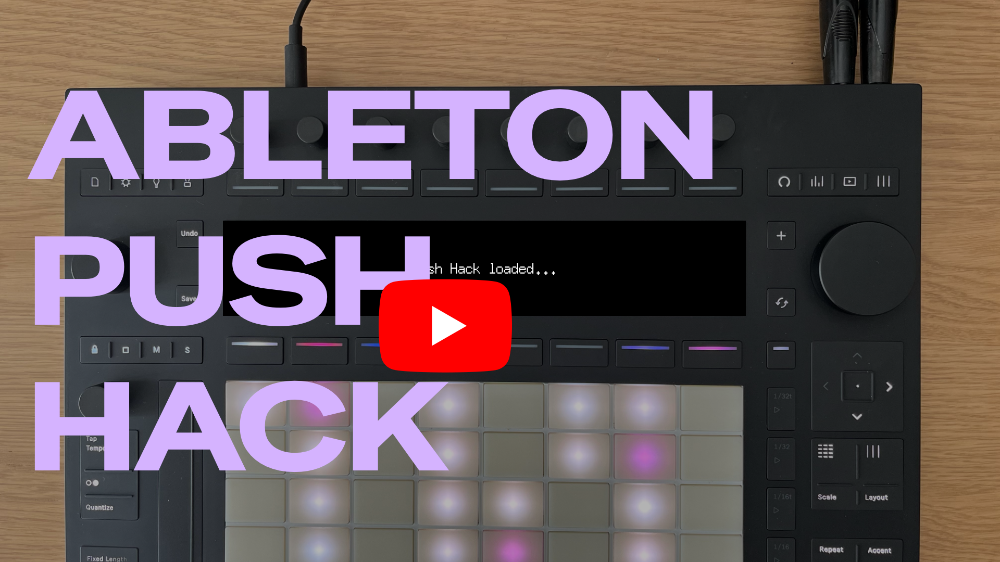

# Ableton Push Hack


**Push Hack** is an unofficial extensible hack framework for **Ableton Push 3 Standalone**. It started as an experiment and it quickly evolved into something bigger than expected but it is still a prototype more than a finished product. While it works, it's not intended for everyday or production use, especially in professional contexts and environments.

If you have a **Push 2** or a **Push 3 Tethered** please [see this project](https://github.com/federico-pepe/push-tethered-app).

This project is inspired by the work done for Ableton Move in the [Move Anything](https://github.com/bobbydigitales/move-anything) and [Schwung](https://github.com/charlesvestal/schwung).

* 📕 [Read the Manual](MANUAL.md)
* 🛟 [Would you like to contribute to the project?](CONTRIBUTING.md)
* 💬 [Join the Discord Community](https://discord.gg/8y6aYxy9nU) to discuss this project.
* 🎥 [Watch the demo video on YouTube](https://www.youtube.com/watch?v=fsYWSZ-MSDk)

---

## ⚠️ Please, read this carefully ⚠️

> [!WARNING]
> This project is <ins>**NOT**</ins> approved, endorsed or supported by Ableton. **Use at your own risk**. Back up important sets, files and samples before installing the hack and familiarize yourself with the [official recovery methods for Push 3 Standalone](https://help.ableton.com/hc/en-us/articles/10726712498076-Recovery-methods-for-Push-3-standalone) in case you need to restore your device.

> [!CAUTION]
> Push Hack must be **uninstalled** an **reinstalled** manually after any Push's software update. Because of that, make sure that your Push is on the latest version available before installing the hack for the first time. You can read more about this in the [manual](MANUAL.md).

--- 
## 📺 Demo Video

This video is not up to date with the latest developments. However, it can still be used as a reference to understand the capabilities of Push Hack.

[](https://www.youtube.com/watch?v=fsYWSZ-MSDk&feature=youtu.be)

---
## 🤖 AI Disclosure

This project and much of its codebase were generated by coding agents, mainly Claude Code, under human supervision. If that makes you uneasy or you're not on board with that approach, no worries at all. Either way, thanks a lot for taking the time to check this project.

---

## 🏗️ Architecture [WIP]

Push Hack only works on Push 3 Standalone because it installs additional software on top of what's already available on Push. It doesn't replace, overwrite or change any original functionalities. 

This hack can't interact directly with what's happening inside Live on Push (unless via Remote Scripts, as explained below), so I had to come up with a series of workarounds:

* Create virtual MIDI I/O ports to send and receive MIDI messages from and to Live on Push. This is required, for example, to take over all the controls (knobs, buttons, LEDs). Some modules might require the user to route MIDI messages inside Push's MIDI Preferences pane.
* Create virtual audio soundcard to send and receive audio from and to Live on Push. This is required, for example, if you want to run a standalone sound module. Users then need to activate the virtual sound card in Push's audio preferences and then route the audio on Push's audio tracks/mixer.
* Use remote scripts to interact with Live on Push for example to load presets on the selected track. The limit is what is available on the Remote Script (Python) Live API.
* From an UI perspective there are two options: run a WebUI and access everything from another device via push.local or implement a custom made ShadowUI if you want all the controls to be accessible on Push's directly. `push-manager` and `push-catalog` for example, use both options.

### Main components

The main component is the `core library`: a shared Go module that can be used and referenced by any additional modules. As the name implies, the core library includes

There are three required *base modules*:

1. **Push Manager**: it's the main component of the hack. It looks like a mobile-friendly web app inspired by *Move Manager* but under the hood it does many different things (see below for all the details)
2. **Push Display**: this module is required to fully control the screen and be able to draw on it.
3. **Push Catalog**: an on-device installer for modules made by the community.

### Push Manager
**Push Manager** was originally inspired by *Move Manager* and it is a mobile-friendly web app running on Push and accessible from any device on the same network (or Push's Wi-Fi hotspot).

With Push Manager you can:

- File management:
  - **Browse, upload, download, rename, delete, copy** files and folders on Push
  - **USB drive support**. Plug in a FAT32/NTFS drive on the USB-A port, then copy files from/to Push. (exFAT is not supported — Push's kernel has no exFAT or FUSE driver. Use FAT32 or NTFS.)
  - **Preset browser** — Push's library is accessible in the browser: fast keyboard search, filter by category / device / source / favourites, free-form tags and ★ favourites, and one-click Load onto the selected track. **⚠️ LOADING presets requires Push 2.4+ and the installation of the PushHackBrowser Remote Script**.
- Display controls:
  - Take over Push 3's screen. You can load **images and videos**
  - **Draw** — draw in the browser with mouse or finger; strokes stream to Push display in real time (~10fps)
- MIDI:
  - **MIDI Monitor** — live stream of all MIDI events via SSE; filterable by type; **Intercept** toggle blocks events from reaching Live while still receiving them
  - **Hardware chords** — hold two Push buttons simultaneously to trigger actions (e.g. Intercept toggle); shows OSD feedback on Push display for 2 seconds
  - **LED control** — set any button or pad LED color
- Other:
  - **System stats** — CPU, memory, disk, IP addresses, hotspot password

**Port:** 7701 → `http://push.local:7701`

### Shadow UI (installed with Push Manager)
Hardware-driven on-device interface rendered directly on Push 3's screen; no computer needed. Same features as Push Manager. Navigate with jog wheel and D-pad.

Use `Shift + Preference` to open/close the Shadow UI.

---

### Push Hack Catalog — install community hacks 
On-device homebrew-style installer. Browse a catalog of community hacks, each published from its own GitHub repo, not hosted by this project — and install/remove them without SSH or a build toolchain.

- Web UI lists every hack's **name, description, author, live version, and last-updated date** (fetched fresh from that hack's own repo on every page load), plus its `requires` (other hacks it depends on).
- **Install/Update/Remove**, one tap, with the shell output shown in a log pane — Update appears once an installed hack falls behind the catalog's live version.
- No sha256 pinning — the trust boundary is "this repo is on GitHub, its catalog entry was PR-reviewed once," the same model as `go get` or a Homebrew tap. See [`catalog/ARCHITECTURE.md`](catalog/ARCHITECTURE.md).
- Want to publish your own hack into it? See [`catalog/PUBLISHING.md`](catalog/PUBLISHING.md).
- Example catalog hacks: Automation (LFO/CC sequencer), Keyboard Visualizer (on-screen piano keyboard), and [Browser Bridge](https://github.com/federico-pepe/push-hack-browser-bridge) (load Live presets onto a track from Push Manager's preset browser — needs a one-time manual activation step in Live's Preferences).

**Port:** 7702 → `http://push.local:7702`

---

### Push Display — LD_PRELOAD display hook
C shared library injected into Push 3's process via `LD_PRELOAD`. Intercepts `libusb_bulk_transfer` calls to the XMOS co-processor and overlays custom pixels on every display frame.

- **Mode 0** — passthrough (Ableton Live UI shows normally)
- **Mode 1** aka Debug mode — orange bar overlay at top of screen
- **Mode 2** — full frame takeover (push-manager writes any image here)
- **Startup splash** — "Push Hack loaded..." text shown a few seconds into each Push boot, then passthrough is restored. The hook stays passive during the USB/hub bring-up window (8s), then briefly takes over to show the splash

---

## Requirements

- Ableton Push 3 Standalone with SSH access enabled (`http://push.local/ssh`)
- Go 1.21+ (for building hacks locally)
- Docker (for building `push_hook.so` — cross-compiles linux/amd64 via `gcc:12-bullseye`)
- macOS or Linux development machine

---

## Quick start: Install

```bash
# 1. Deploy all hacks (pre-built binaries, no Go/Docker toolchain needed)
#    The installer will guide you through SSH key setup if needed,
#    then ask you to accept a disclaimer before proceeding.
./scripts/install.sh

# 2. Open Push Manager in browser
open http://push.local:7701
```

---

## Scripts

| Script | Purpose |
|--------|---------|
| `./scripts/discover.sh` | Probe Push OS — init system, paths, processes, ports |
| `./scripts/install.sh` | Build + deploy all (or one) hack, register service |
| `./scripts/uninstall.sh` | Remove all hacks and services cleanly |

```bash
./scripts/discover.sh  --host 192.168.1.67   # use IP instead of hostname
./scripts/install.sh   --hack push-manager   # deploy one hack only
./scripts/install.sh   --build               # build from source (default: use pre-built)
./scripts/install.sh   --dry-run             # print actions without executing
./scripts/uninstall.sh --purge               # also delete /data/push-hack data
./scripts/uninstall.sh --yes                 # skip confirmation prompt
```

**push-display** is handled by `./scripts/install.sh` — its `service.initd` copies `push_hook.so`, patches `LD_PRELOAD` into Push3's init script, and restarts push3 automatically. For standalone re-deploys:
```bash
hacks/push-display/deploy.sh           # build + deploy + restart
hacks/push-display/deploy.sh --no-build  # deploy pre-built .so only
```

---

## Adding a new hack

```bash
mkdir -p hacks/my-hack/src
```

Create `hacks/my-hack/hack.json`:
```json
{
  "id": "my-hack",
  "name": "My Hack",
  "binary": "my-hack",
  "enabled": true,
  "allowed_roots": [],
  "settings": {}
}
```

Create `hacks/my-hack/Makefile`:
```makefile
all:
	cd src && GOOS=linux GOARCH=amd64 go build -ldflags "-s -w" -o ../my-hack .
```

Write your service in `hacks/my-hack/src/`, then:
```bash
./scripts/install.sh --hack my-hack
```

The framework auto-generates a sysvinit init.d script and registers it with `update-rc.d`. Your hack survives reboots. For no-binary hacks (shell scripts, udev rules), set `"binary": ""` and provide a `service.initd` template. `./scripts/install.sh` (unlike `push-catalog install`) does not assign a port for you — add `"port": <n>` to `hack.json` for local testing, any free value `>= 7711` (7701–7710 is reserved for the framework: 7701 = push-manager, 7702 = push-catalog). Once you publish through `push-catalog`, it assigns a port automatically on every install and overwrites this value, so you can drop the field entirely from what you publish.

Prefer not building/deploying it yourself? [`push-catalog`](hacks/push-catalog/) is an on-device installer — browse and install community-published hacks straight from your phone. See `catalog/PUBLISHING.md` for how to publish your own hack into it.

### Core shared library

Before hand-rolling ALSA MIDI, HTTP boilerplate, or SSE for a new hack, check `core/` — a shared Go module with the pieces push-manager/automation/keyboard-visualizer all reuse: Push 3 constants (`core/push3`), image drawing (`core/gfx`), the display shm codec (`core/display`), HTTP middleware (`core/httpx`), config loading (`core/hackcfg`), SSE broadcasting (`core/sse`), an HTTP client for push-manager's display/tempo API (`core/pmclient`), and the ALSA sequencer layer (`core/alsaseq`) — open a port, send/receive MIDI, enumerate devices, all without touching an ioctl directly. See `core/README.md`.

Pull it in from `hacks/my-hack/src/go.mod`:
```
require github.com/federico-pepe/ableton-push-hack/core v0.0.0
replace github.com/federico-pepe/ableton-push-hack/core => ../../../core
```

---

## Uninstall

```bash
# Remove services + binaries, keep /data/push-hack directory
./scripts/uninstall.sh

# Full removal including all data
./scripts/uninstall.sh --purge --yes
```

---

## Reference

`docs/` = architecture, API, and Push hardware/OS references; each hack documents itself in its folder README.

**Framework and API** (`docs/`):
- `docs/architecture.md` — deploy framework, hack structure, `core/` shared library, per-hack file layout
- `docs/api-reference.md` — HTTP routes, the RemotePanel contract, the push-display shared-memory protocol

**Push hardware / OS** (`docs/`):
- `docs/push3-internals.md` — OS, filesystem, XMOS USB protocol, display, MIDI routing
- `docs/push3-button-map.md` — Push 3 button/encoder MIDI map
- `docs/push3-led-colors.md` — full 128-entry LED color palette
- `docs/push3-assets.md` — Push UI image assets (`/api/assets/<path>`)

**Shared library:**
- `core/README.md` — package-by-package guide to the shared Go module (push3, gfx, display, httpx, hackcfg, sse, pmclient, alsaseq)

**Per-hack** (folder README):
- `hacks/push-manager/README.md` — full API reference, features, display control, MIDI monitor
- `hacks/push-display/README.md` — LD_PRELOAD display/MIDI hook, shared-memory layout, build/deploy
- `hacks/push-catalog/README.md` — on-device installer API, how the catalog install flow works

**Catalog (`catalog/`):** `catalog/ARCHITECTURE.md`, `catalog/schema.md`, `catalog/PUBLISHING.md` — the push-catalog model and how to publish a hack into it

---
## License

MIT - See [LICENSE](LICENSE)